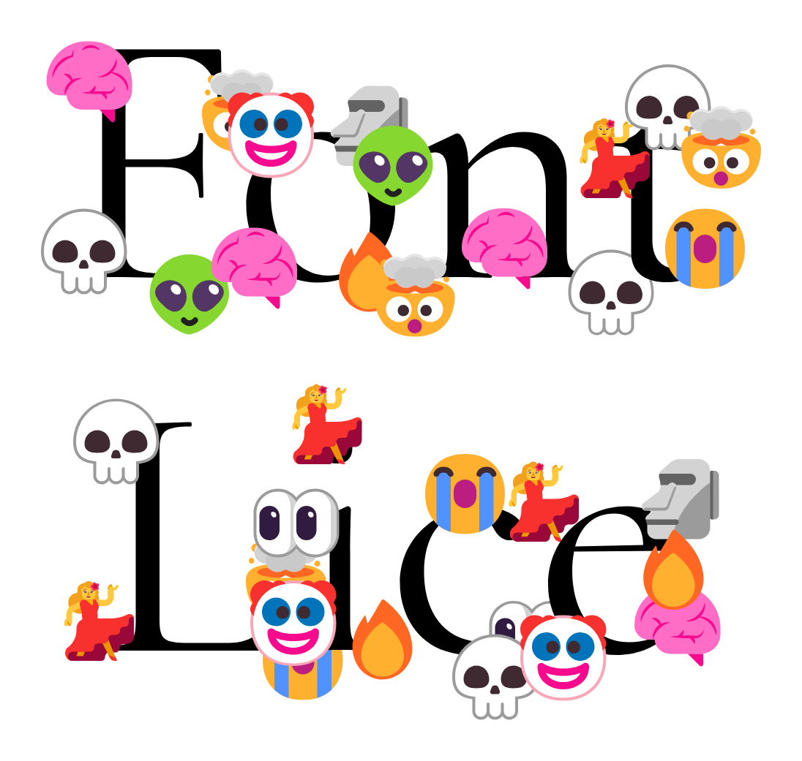

# Font Lice

A display serif with an infestation. Small emoji icons attach themselves to letterforms at their most structurally vulnerable points. Hairline strokes, serif tips, terminals, and curve junctions all become host sites for digital organisms.

## Download

The font files are in [`fonts/`](fonts/): OTF or TTF for desktop use,
WOFF2 for the web.

## Details

- Released Mar 20, 2026
- 1 style
- OTF, WOFF2
- Desktop and web use
- SIL Open Font License 1.1
- Based on Cormorant by Christian Thalmann (OFL)
- Emoji artwork from Microsoft Fluent Emoji (MIT)

---

Part of [Michael's Fonts](https://michaelsfonts.com). This repository is archived:
the font is finished and is kept here for reference.